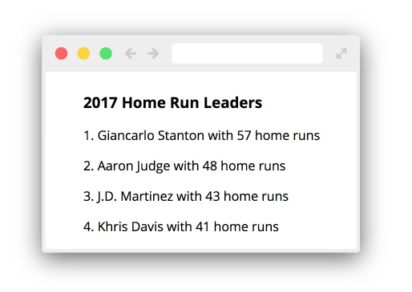
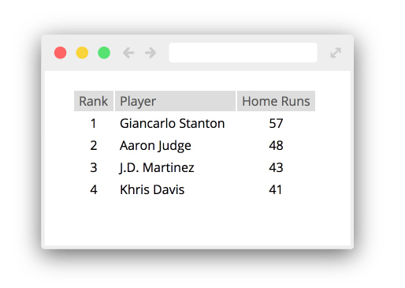
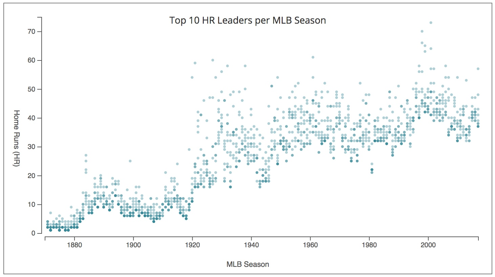
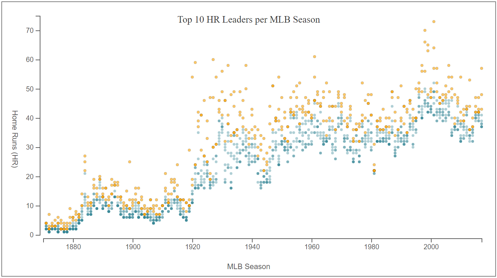
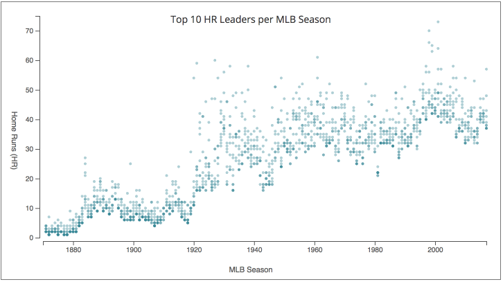

## Activity 1: Creating a List of Data
| name              | rank | year | homeruns |
|-------------------|------|------|----------|
| Giancarlo Stanton | 1    | 2017 | 57       |
| Aaron Judge       | 2    | 2017 | 48       |
| J.D. Martinez     | 3    | 2017 | 43       |
| Khris Davis       | 4    | 2017 | 41       |

For this activity you will use d3 data binding to create a paragraph (`
`) for each player in the list. You will also add text content to each paragraph to describe the player's Home Runs for this season and their rank. In the end your web page should look like this:

## Activity 2: Drawing a Pixel Scatterplot

You will create the following scatterplots during this activity:

## Activity 3: Drawing a Pixel Scatterplot

See below for how the hover interaction looks:

**This lab is based on the following material:**

* Hanspeter Pfister's CS171 Lab Material (Harvard)
* [DOM Manipulation and D3 Fundamentals](http://dataviscourse.net/2015/lectures/lecture-d3/) by Alex Lex of U. of Utah
* [Practical applications of a d3js selection](https://github.com/billautomata/d3js_design_patterns/blob/master/volume-3.md)
* [D3 - Interactive Data Visualization for the Web](http://alignedleft.com/work/d3-book-2e) by Scott Murray
