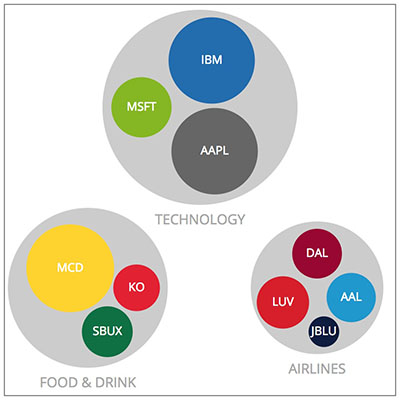

***

**This lab was based on the following material:**

* [Nested Selections](https://bost.ocks.org/mike/nest/) by Mike Bostock
* [Manipulating data like a boss with d3](https://codepen.io/collection/njzYxo) by Jerome Cukier
* [Advanced D3: More on selections and data, scales, axis](http://dataviscourse.net/2016/lectures/lecture-advanced-d3/) by A. Lex of U. of Utah
