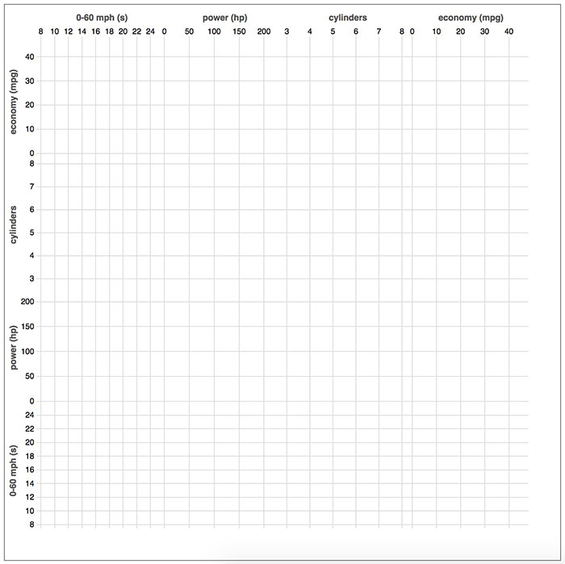
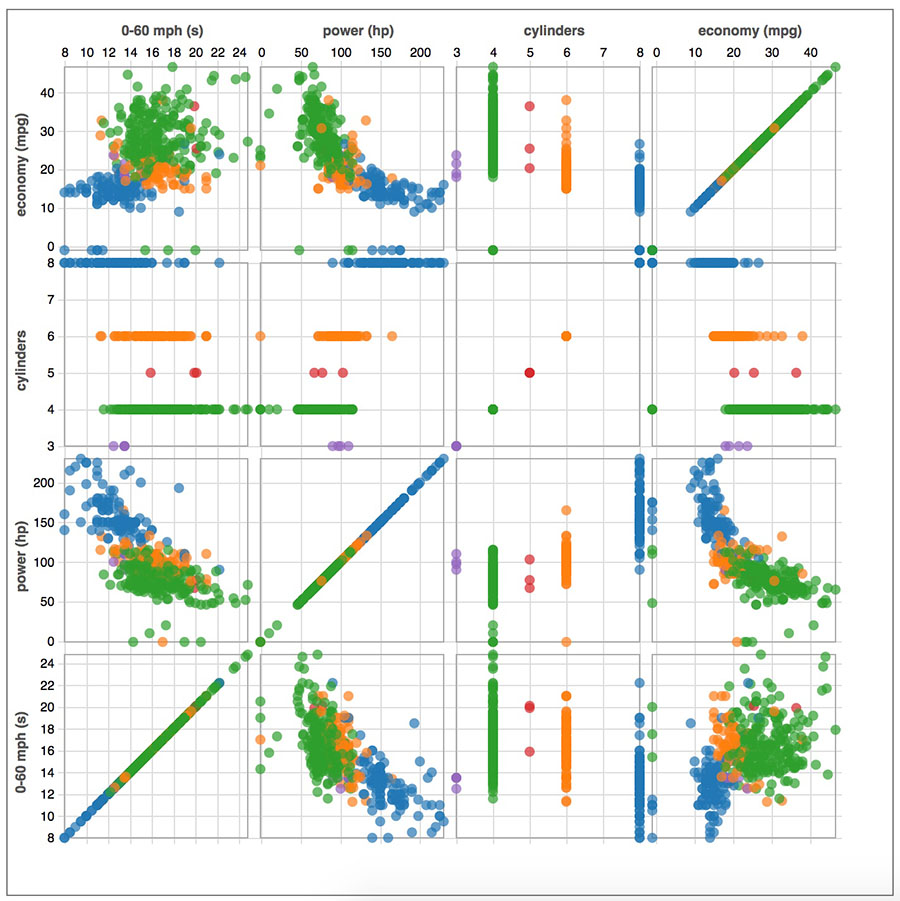
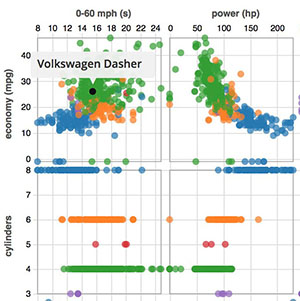

### Learning Objectives

After completing this lab you will:
* Have a better understanding of system design and code structure for multiple views
* Know how to link multiple views with each other
* Understand the concept behind D3's brush component
* Know how to create an HTML div Tooltip

### Prerequisites

* Download the corresponding lab from the code repo (either using git or downloading the folder from the code of this repo (in the Code tab above))
* You have **read Chapter 10** in [D3 - Interactive Data Visualization for the Web](http://alignedleft.com/work/d3-book-2e) by Scott Murray

### Recommended Reading

* [Scatterplot Matrix Brushing, v3 code but still relevant](https://bl.ocks.org/mbostock/4063663) by Mike Bostock
* [Brush & Zoom](https://bl.ocks.org/mbostock/34f08d5e11952a80609169b7917d4172) by Mike Bostock
<!-- * [JavaScript*: This, That And The Other Thing](https://software.intel.com/en-us/xdk/blog/javascript-this-that-and-the-other-thing) by Dale Schouten -->

### Additional Reading

* [d3 tooltip for v4](https://github.com/VACLab/d3-tip) by Dave Gotz
* [MDN - Introducing JavaScript Objects](https://developer.mozilla.org/en-US/docs/Learn/JavaScript/Objects)
* [W3C Schools - JavaScript Objects](https://www.w3schools.com/js/js_object_definition.asp)

### What to submit

* You should have completed Activity 1, Activity 2, and Activity 3 (in each respective subfolder, which you will have created by the end of this lab).
* Submit a link to your repository to canvas  

### Grading

Your assignment will be graded on the following requirements:
* Functionality of Activity 1, 2, 3 completed

## Getting Familiar with Today's Activities

Previously you have learned the fundamentals of D3 and you have gained some implementation expertise during labs and programming assignments. You should be comfortable with the major concepts and be able to implement common charts as well as interactive and more advanced visualizations with D3.

In this lab, you will be working on one visualization system - a ScatterPlot Matrix (aka Splom). It will give you a better understanding of linked views and system design for creating a visualization system. By the end of the lab, you will have created this ScatterPlot Matrix for the cars dataset:

We will provide a template and many additional code snippets so that your main tasks will focus on the structure and the event handling components. However, please make sure that you understand the code in the provided templates, and take your time to read through it!

> Reminder: Start an http server for this lab's directory. From command line call `python -m SimpleHTTPServer 8080` (for Python 2) or `python -m http.server 8080` (for Python 3).

#### How to structure your code for interaction

Like previous weeks we have already added structure to your `activities\main.js` code. This should help speed up the time it takes to complete the lab - notice we've added more than usual. There are a number of additions to the code:

* `xScale` and `yScale` - global x-,y-scales for all cells of the Splom, already configured
* `xAxis` and `yAxis` - global x-,y-axes for all cells of the Splom, already configured and the grids have been rendered
* `colorScale` - ordinal color scale for the `cylinders` color mapping
* `dataAttributes` - a list of the 4 data attributes or columns that make up the matrix of the Splom
* `extentByAttribute` - a map of the `[min,max]` for each of the attributes, this is used to update the global scales `xScale` and `yScale` on the cell's x and y attributes
* Layout parameters for configuring the spacing of your chart. `cellWidth`, `cellHeight` and `chartPadding`
* `d3.csv('cars.csv', dataPreprocessor).then(...)` is included 
* `style.css` - **all required css styling for the activities has been added for you**

**Take some time to look through the template and read the comments.**

*When you start your server and open the website, notice the gridlines have already been added for you.*

#### Car Data

During today's activities you will be working with the `cars.csv` dataset. The dataset includes 406 rows. Each row corresponds to a model and make of car. The dataset also includes a lot of interesting performance measures for each of these cars:

| `name`           |`economy (mpg)`|`cylinders`|`displacement (cc)`|`power (hp)`|`weight (lb)`|`0-60 mph (s)`|`year`|
|------------------|---------------|-----------|-------------------|------------|-------------|--------------|------|
| Ford Escort 2H   | 29.9          | 4         | 98                |65          |2380         |20.7          |81    |
| Ford Gran Torino | 16            | 8         | 302               |140         |4141         |14            |74    |
| Honda Civic      | 33            | 4         | 91                |53          |1795         |17.4          |76    |
| Subaru DL        | 30            | 4         | 97                |67          |1985         |16.4          |77    |
| Subaru DL        | 33.8          | 4         | 97                |67          |2145         |18            |80    |

#### Structuring for success

You should always try to split a complex problem into smaller, easier-to-tackle sub-problems. Each sub-problem will be solved independently and afterward integrated into the final system.

Visualizations should be organized and structured into individual code components and, if possible, implemented as flexible and reusable components. Therefore, we will organize each ScatterPlot Matrix Cell as an `object`.

You should avoid "copying" code. Copying code often leads to type-o's which then manifest themselves as bugs that are difficult to decipher what went wrong. Before you copy your code, think about how you can abstract that block of code into a reusable component.

For example, in today's lab, we will be creating the following ScatterPlot Matrix:

Notice that this isn't a Trellis Plot. Each of the cells has a different `x-`, `y-scale`. This allows us to analyze all 4 data columns crossed with each other. In this case, we want to create an `object`, or better yet a `class` to reference the cell properties (e.g. `x-`, `y-scale`) and implement similar methods such as drawing the cell.

## Activity 1: Visualizations as Objects

#### 1. Create `SplomCell` constructor function

We can create a reusable `object` for our Splom cells by creating a "class" ... the JavaScript way:

    // ****** Add reusable components here ****** //
    function SplomCell(x, y, col, row) {
        this.x = x;
        this.y = y;
        this.col = col;
        this.row = row;
    }

This should look familiar to other programming languages, but there is no `class` reserved word in JS. Instead, we use a *constructor function*. Then to define properties and methods for an object created using `function()`, you use the `this` keyword, as seen in the above code.

Add the above block of code to `activities/main.js` where it says to `Add reusable components here`. The *constructor function* creates an `object` with properties for `x`, `y` data attributes (`string`) that define the `x-` and `y-scale` for this Splom cell. The `col` and `row` represent the indices (`number`) for the cell - these are needed for positioning the cell within the overall matrix.

#### 2. Instantiate 16 `SplomCell`s

To instantiate a cell use the `new` keyword:

	var cell = new SplomCell(<x attribute>, <y attribute>, <column index>, <row index>);

Instead of creating just one `SplomCell`, we want to create 16 of them to fill in our matrix. We are going to use the following 4 data attributes for the matrix (`dataAttributes` is already included in your code):

	var dataAttributes = ['economy (mpg)', 'cylinders', 'power (hp)', '0-60 mph (s)'];

Now copy the following nested for loop to *(1) create the 16 `SplomCell` objects* and *(2) add them to the `cells` array for future use*:

    var cells = [];
    dataAttributes.forEach(function(attrX, col){
        dataAttributes.forEach(function(attrY, row){
            cells.push(new SplomCell(attrX, attrY, col, row));
        });
    });

Try logging the `cells` array to check that your SplomCell objects were created properly.

#### 3. Define the `init` and `update` method

Now we'll add methods to our `SplomCell` class using the `Object.prototype` properties. 

> `Object.prototype`:

> * All JavaScript objects inherit their properties and methods from their prototype
> * The methods are in the execution context of the object
> * The object property prototype allows you to add new properties/methods to an existing prototype

Add the `init` method to the `SplomCell.prototype` properties:

    SplomCell.prototype.init = function(g) {
        var cell = d3.select(g);

        cell.append('rect')
          .attr('class', 'frame')
          .attr('width', cellWidth - cellPadding)
          .attr('height', cellHeight - cellPadding);
    }

When called, `init()` takes the `g` element for the cell as an input and creates the rectangle frame for this cell. We use the layout parameters `cellWidth`, `cellHeight`, and `cellPadding` to create the correct dimensions.

Next add the `update` function to update the cell based on the incoming `data`. This method uses the D3 Enter, Update, Exit Pattern in order to support adding circles when initially called, or filtering out/in circles based on the input field `data`. You should be proficient with this update method by now:

    SplomCell.prototype.update = function(g, data) {
        var cell = d3.select(g);

        // Update the global x,yScale objects for this cell's x,y attribute domains
        xScale.domain(extentByAttribute[this.x]);
        yScale.domain(extentByAttribute[this.y]);

        // Save a reference of this SplomCell, to use within anon function scopes
        var _this = this;

        var dots = cell.selectAll('.dot')
            .data(data, function(d){
                return d.name +'-'+d.year+'-'+d.cylinders; // Create a unique id for the car
            });

        var dotsEnter = dots.enter()
            .append('circle')
            .attr('class', 'dot')
            .style("fill", function(d) { return colorScale(d.cylinders); })
            .attr('r', 4);

        dots.merge(dotsEnter).attr('cx', function(d){
                return xScale(d[_this.x]);
            })
            .attr('cy', function(d){
                return yScale(d[_this.y]);
            });

        dots.exit().remove();
    }

We recommend creating another variable (e.g. `_this`) to store the `this`-accessor for the SplomCell object. *Otherwise the scope of `this` will change within an anonymous function and cause undesirable side-effects*.

#### 4. Draw the 16 `SplomCell`s

Now we will use both of these methods `SplomCell.init()` and `SplomCell.update()` to draw the cells of your ScatterPlot Matrix. To do this we will need to create a `g` element for each `SplomCell` within our `cells` array. What's a great way to append an array of elements to the SVG? ... You guessed it, D3! We will make a data-join with our `cells` array and append a `g` element for each `SplomCell` object with the `ENTER` selection:

    var cellEnter = chartG.selectAll('.cell')
        .data(cells)
        .enter()
        .append('g')
        .attr('class', 'cell')
        .attr("transform", function(d) {
            // Start from the far right for columns to get a better looking chart
            var tx = (N - d.col - 1) * cellWidth + cellPadding / 2;
            var ty = d.row * cellHeight + cellPadding / 2;
            return "translate("+[tx, ty]+")";
         });
         
Now that we have 16 `g.cell` elements positioned correctly in the SVG we can initialize and draw each `SplomCell`. To do this, we will use `d3-selection.each()`. `each()` invokes the specified function for each selected element, in order, being passed the current `SplomCell` object as `cell` and `this` as the current DOM element.

    cellEnter.each(function(cell){
            cell.init(this);
            cell.update(this, dataset);
        });
    });

With `each(function(cell){...})`, we get passed each `SplomCell` as `cell` that is joined to the 16 `g.cell` elements we just appended. We can then call `init` and `update` on the `SplomCell` object. Remember in the data-callback function, `this` refers to the current DOM element (i.e. `g.cell`).

You should now have a static ScatterPlot Matrix:

At this point, rename the `activities` folder as `activity_1`. Duplicate this folder and name it as `activity_2`. You will start there for the next activity. 

## Activity 2: Brushing and Linking

The D3 brush is comparable to D3's axis component. You have to initialize the brush and then append a new `g` element to `call()` your brush function on. Internally, the brush uses `selection.on` to bind the necessary event listeners for dragging.

The brush also creates the SVG elements necessary to display the brush selection and to receive input events for interaction. You can add, remove or modify these elements as desired to change the brush appearance; you can also apply stylesheets to modify the brush appearance.

The event binding `on` sets an event listener, whereby you can choose between three different events:

* `start` - at the start of a brush gesture, such as on mousedown.
* `brush` - when the brush moves, such as on mousemove.
* `end` - at the end of a brush gesture, such as on mouseup.

Brushes can be two-dimensional or one-dimensional. 

* `d3.brush()` - creates a new two-dimensional brush.
* `d3.brushX()` - creates a new one-dimensional brush along the x-dimension -  *(Hint: use this one for P4)*
* `d3.brushY()` - creates a new one-dimensional brush along the y-dimension.

[D3-Brush API](https://github.com/d3/d3-brush)

#### 1. Instantiate a brush object

We are going to instantiate one d3-brush function for all of the cells. We can do this because all the cells have the same dimensions (*add this block at the top of `main.js`*):

    var brush = d3.brush()
        .extent([[0, 0], [cellWidth - cellPadding, cellHeight - cellPadding]])
        .on("start", brushstart)
        .on("brush", brushmove)
        .on("end", brushend);

`.extent()` takes a 2x2 matrix for the pixel extent of the brush. We want to restrict the brush to the cell`s pixel dimensions.

You will notice that we have also pointed to event listener functions for the `start`, `brush`, and `end` functions. We will define these functions next.

#### 2. Define brush event listeners

We will use the `start`, `brush`, and `end` to create a behavior for brushing on the selected dots in the other `SplomCell`s. To achieve this we should create the following functions:

* `brushstart` - clear any old brushes and setup the new brush
* `brushmove` - *the actual brushing occurs here*, hide any circles that that are outside the bounds of the brush's bounds
* `brushend` - clean up the brush if its been cleared by the user, bring back any hidden circles

Any time we are using d3 special events such as `brush` or `drag`, we need to access the global `d3.event` within the event listener for the event. The `d3.event` object contains properties that represent that event. In the case of `brush` the property `d3.event.selection` specifies the bounding box or extent of the brush (in pixels). Putting this all together we will create the following the event listener functions (*add these anywhere*):

    function brushstart(cell) {
        // cell is the SplomCell object

        // Check if this g element is different than the previous brush
        if(brushCell !== this) {

            // Clear the old brush
            brush.move(d3.select(brushCell), null);

            // Update the global scales for the subsequent brushmove events
            xScale.domain(extentByAttribute[cell.x]);
            yScale.domain(extentByAttribute[cell.y]);

            // Save the state of this g element as having an active brush
            brushCell = this;
        }
    }

    function brushmove(cell) {
        // cell is the SplomCell object

        // Get the extent or bounding box of the brush event, this is a 2x2 array
        var e = d3.event.selection;
        if(e) {

            // Select all .dot circles, and add the "hidden" class if the data for that circle
            // lies outside of the brush-filter applied for this SplomCells x and y attributes
            svg.selectAll(".dot")
                .classed("hidden", function(d){
                    return e[0][0] > xScale(d[cell.x]) || xScale(d[cell.x]) > e[1][0]
                        || e[0][1] > yScale(d[cell.y]) || yScale(d[cell.y]) > e[1][1];
                })
        }
    }

    function brushend() {
        // If there is no longer an extent or bounding box then the brush has been removed
        if(!d3.event.selection) {
            // Bring back all hidden .dot elements
            svg.selectAll('.hidden').classed('hidden', false);
            // Return the state of the active brushCell to be undefined
            brushCell = undefined;
        }
    }

#### 3. Call the brush function

Finally to add the brush interaction to each ScatterPlot Cell we need to `.call()` the brush function on each of the 16 `g.cell` elements. This is similar to how we append a new `g` element and `.call(axis)`. However, with brush a rectangle is added that fills the `extent()` that we defined earlier, as well as other elements such as brush handles.

Going back within `d3.csv` - we are going to use the `cellsEnter` to add brushing to all 16 cells:

	cellEnter.append('g')
		.attr('class', 'brush')
		.call(brush);
        
Now we have the following brushing interaction:

If you inspect the DOM you can see the elements that were added to the `.brush` group that we just appended.

At the end of Activity 2, duplicate this folder and name it as `activity_3`. You will start there for the next activity.

## Activity 3: Advanced Tooltips

Up until this point we have only implemented simple hovering interactions. Here we are going to cover how to use HTML elements such as `
` and `<table>` to create more informative tooltips.

You may have noticed that the project includes an additional `d3-tip.js` JavaScript file - we have also linked to this external library in the `index.html`. The d3-tip library uses the global namespace `d3.tip`. d3-tip is an open source library that allows us to easily add, customize, and show a `
` tooltip for SVG elements that the user hovers on. The library takes care of creating the `
` element and placing it relative to the hovered SVG element.

We will start out simple by showing the car's name on hover.

#### 1. Instantiate the d3-tip object

To create the d3-tip we call `d3.tip()` which returns a special kind of d3-selection. Then we can specify some properties for the tooltip:

* `tip.offset([values])` - offset a tooltip relative to its calculated position. Offset is computed from `[top, left]`
* `tip.html([content])` - set the tip's HTML content, can use a data callback `function(d){...}` to set the HTML based on the hovered data

We'll use these to instantiate the tooltip (*add at the top of `main.js`*)

    var toolTip = d3.tip()
        .attr("class", "d3-tip")
        .offset([-12, 0])
        .html(function(d) {
            return "<h5>"+d['name']+"</h5>";
        });
        
Now we need to `.call()` the toolTip on the svg to register it:

    svg.call(toolTip);

#### 2. Create mouse hover listeners

Finally to add the hovering functionality we need to go back into `SplomCell.prototype.update` to add `.on('mouseover')` and `.on('mouseout')` event bindings to `dotsEnter`:

    dotsEnter.on('mouseover', toolTip.show)
        .on('mouseout', toolTip.hide);
        
The basic functionality that we want is for the tooltip to show up on `mouseover` (start hovering), and then hide on `mouseout` (end hovering).

We should see the following hover tooltip:

**Wait! I don't see my tooltip showing up!**

You might have noticed that the `.brush` elements are in front of the circles that we are trying to hover on. The `.brush` elements, therefore, receive all mouse events, while our circles are left out in the interaction cold.

To support brushing and hovering at the same time we want to have the `.brush` elements appear below the circles. If you remember from earlier labs there is no `z-index` attribute for SVG - the same way that paints on a canvas appear below more recently applied paint; SVG elements appear below more recently added SVG elements. So if we switch the order in which we add the brush to when we added circles we can change the z-ordering:

    cellEnter.append('g')
        .call(brush);

    cellEnter.each(function(c){
        c.init(this);
        c.update(this, dataset);
    });
    
And now our tooltip should appear on hover.

**This lab was based on the following material:**

* Hanspeter Pfister's CS171 Lab Material (Harvard)
* [D3 - Interactive Data Visualization for the Web](http://alignedleft.com/work/d3-book-2e) by Scott Murray
* [Scatterplot Matrix Brushing, v3 code but still relevant](https://bl.ocks.org/mbostock/4063663) by Mike Bostock
* [d3 tooltip for v4](https://github.com/VACLab/d3-tip)
